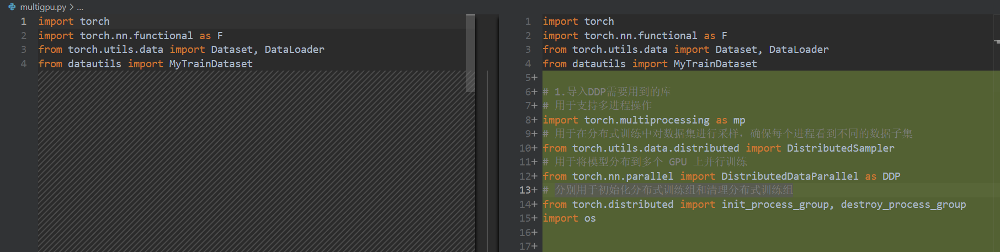

一些粗略的参考，更详细的参考会在对应的小节里面提到。

[Part 1: Welcome to the Distributed Data Parallel (DDP) Tutorial Series](https://www.youtube.com/watch?v=-K3bZYHYHEA&list=PL_lsbAsL_o2CSuhUhJIiW0IkdT5C2wGWj&index=2)

[Efficient Training of Large Language Models on Distributed...](https://arxiv.org/abs/2407.20018)

[动画理解Pytorch 大模型分布式训练技术 DP，DDP，DeepSpeed ZeRO技术_哔哩哔哩_bilibili](https://www.bilibili.com/video/BV1mm42137X8/?spm_id_from=333.337.search-card.all.click&vd_source=cbcc0f860e979710ca238ab1cdbe2a75)

[ZeRO & DeepSpeed: New system optimizations enable training models with over 100 billion parameters - Microsoft Research](https://www.microsoft.com/en-us/research/blog/zero-deepspeed-new-system-optimizations-enable-training-models-with-over-100-billion-parameters/)

## 简要介绍

并行方案包括：Hybrid Parallelism(混合并行), Auto Parallelism(自动并行), and Heterogeneous Parallelism(异构并行)，目前以混合并行最为常见，也是最成熟最容易插入到自己的代码中实现即插即用的，所以后面**主要是对混合并行进行简要的原理介绍和具体的代码实现，其它并行技术则会贴上一些介绍的比较好的博客或者原论文以供阅读**。

Hybrid Parallelism(混合并行)：混合并行通常结合多种手工制作的并行化策略来划分LLM的不同并行化维度，又可以细分为：

- data parallelism：数据并行，**将训练数据集划分为多个子集，每个GPU复制完整模型参数或划分模型参数(扩展优化技术)**，独立处理不同数据，最终同步梯度或参数。适用于模型参数量适中（单卡可容纳），但数据量大的场景（下面介绍到的DDP、FSDP、ZeRO都属于数据并行和相关的优化技术，是目前最常用，最方便“即插即用”的方法，所以这里会进行着重介绍）。
- tensor parallelism：张量并行，**按模型内部张量的维度拆分计算**（如矩阵的行或列），分配到不同GPU，通信整合结果。解决超大参数模型（如千亿参数模型）的单卡内存瓶颈。
- pipeline parallelism：流水线并行，**将模型按层切分到不同GPU**，数据以"微批次（micro-batch）"流经各阶段（如PipeDream、GPipe）。模型层数较多（如深层次Transformer），可横向扩展至多设备。
- sequence parallelism：**将长序列样本（如文本token）拆分到不同GPU**，独立处理子序列并协同计算注意力机制，处理超长序列（如数万token的文本），降低单卡内存占用。
- expert parallelism：混合专家模型（MoE）中，将**不同的专家子网络分配到不同GPU**，通过路由机制动态分配样本

如果用一个表格进行简单的比较：

| 并行方式 | 拆分维度 | 通信开销 | 适用场景 |
| --- | --- | --- | --- |
| 数据并行 | 数据批次 | 低 | 数据量大，模型小 |
| 张量并行 | 模型张量（行/列） | 高 | 单层参数量过大（如矩阵乘法） |
| 流水线并行 | 模型层 | 中 | 模型深但层参数量小 |
| 序列并行 | 输入序列长度 | 中-高 | 超长序列处理（如文本tokens） |
| 专家并行 | 模型稀疏路径 | 动态分配 | 万亿参数规模的稀疏模型 |

## DDP(**Distributed Data Parallel**)

### 单机多卡

> **数据并行**，程序会为每个GPU创建一个进程，每个进程中有对应的模型和优化器本地副本，并且每个优化器上不仅模型参数相同（有相关的扩展优化技术对模型参数进行分片，如FSDP，后面会进行介绍），优化器的随机数种子也相同。DDP会在训练过程内部维持这种同步。每个不同的进程中会接受到不同的数据集样本采样（即Data Parallel，数据并行）。
> 

**更加具体的原理部分请参考引用链接中的B站视频部分。**

代码来源（对应的文件路径为`distributed/ddp-tutorial-series/multigpu.py`）：

[GitHub - pytorch/examples: A set of examples around pytorch in Vision, Text, Reinforcement Learning, etc.](https://github.com/pytorch/examples/tree/main)

**经过处理的带注释的所有文件在：**

[Basic-LLM-Learning/Distributed training/DDP at master · CYRYGBG/Basic-LLM-Learning](https://github.com/CYRYGBG/Basic-LLM-Learning/tree/master/Distributed%20training/DDP)

如果要对单卡训练的代码进行修改，使用DDP进行训练，代码中有几个部分需要修改：

1. **导入DDP需要用到的库**



```python
# 1.导入DDP需要用到的库
# 用于支持多进程操作
import torch.multiprocessing as mp
# 用于在分布式训练中对数据集进行采样，确保每个进程看到不同的数据子集
from torch.utils.data.distributed import DistributedSampler
# 用于将模型分布到多个 GPU 上并行训练
from torch.nn.parallel import DistributedDataParallel as DDP
# 分别用于初始化分布式训练组和清理分布式训练组
from torch.distributed import init_process_group, destroy_process_group
import os
```

2. **增加DDP相关参数设置的函数** 

```python
# 2.增加DDP相关参数设置的函数
def ddp_setup(rank, world_size):
    """
    设置分布式数据并行(DDP)环境，在训练前需要调用完成设置

    Args:
        rank (int): 当前进程的唯一标识符(通常为 0 到 world_size-1)。
        world_size (int): 参与分布式训练的总进程数（通常等于 GPU 的数量）。
    """
    # 设置主节点的地址，这里使用本地主机（localhost）作为主节点
    os.environ["MASTER_ADDR"] = "localhost"

    # 设置主节点的端口号，确保所有进程使用相同的端口进行通信
    # 主节点（MASTER_ADDR 和 MASTER_PORT）负责协调所有进程之间的通信，
    # 分布式训练需要所有进程能够互相通信，因此这些设置必须一致
    os.environ["MASTER_PORT"] = "12355"

    # 设置当前进程使用的 GPU 设备，rank 通常对应 GPU 的索引
    torch.cuda.set_device(rank)

    # 初始化进程组，用于分布式训练
    # - backend="nccl": 使用 NCCL 后端，NCCL 是 NVIDIA 提供的用于多 GPU 通信的高性能库
    # - rank=rank: 当前进程的标识符
    # - world_size=world_size: 总进程数
    init_process_group(backend="nccl", rank=rank, world_size=world_size)
```

3. **将模型封装到DDP中，用于后面对应GPU进程中模型参数的分发**


```python
class Trainer:
    def __init__(
        self,
        model: torch.nn.Module,
        train_data: DataLoader,
        optimizer: torch.optim.Optimizer,
        gpu_id: int,
        save_every: int,
    ) -> None:
        self.gpu_id = gpu_id
        self.model = model.to(gpu_id)
        self.train_data = train_data
        self.optimizer = optimizer
        self.save_every = save_every
        # 3.将模型封装到DDP中，用于后面对应GPU进程中模型参数的分发
        self.model = DDP(model, device_ids=[gpu_id])
```

4. **由于model现在是DDP的封装，不能直接通过model.state_dict()来直接获取模型的参数了**


```python
def _save_checkpoint(self, epoch):
        # 4.由于model现在是DDP的封装，不能直接通过model.state_dict()来直接获取模型的参数了
        ckp = self.model.module.state_dict()  
        PATH = "checkpoint.pt"
        torch.save(ckp, PATH)
        print(f"Epoch {epoch} | Training checkpoint saved at {PATH}")
```

5. **由于每个进程中的模型参数是一样的，所以只需要保存一个进程上的模型参数**


```python
def train(self, max_epochs: int):
        for epoch in range(max_epochs):
            self._run_epoch(epoch)

            # 5.由于每个进程中的模型参数是一样的，所以只需要保存一个进程上的模型参数
            if self.gpu_id == 0 and epoch % self.save_every == 0:
                self._save_checkpoint(epoch)
```

6. **由于已经指定了采样器，所以将shuffle设置为false**

7. **保证数据集会被切分到不同的进程中，并且不会产生重复样本**


```python
def prepare_dataloader(dataset: Dataset, batch_size: int):
    return DataLoader(
        dataset,
        batch_size=batch_size,
        pin_memory=True,
        shuffle=False,  # 6.由于已经指定了采样器，所以将shuffle设置为false
        sampler=DistributedSampler(dataset)  # 7.保证数据集会被切分到不同的进程中，并且不会产生重复样本
    )
```

8. **需要初始化进程组**

9. **确保在训练完成后正确关闭分布式进程组，释放资源并停止后台进程**


```python
def main(rank: int, world_size: int, save_every: int, total_epochs: int, batch_size: int):
    ddp_setup(rank, world_size)  # 8.需要初始化进程组
    dataset, model, optimizer = load_train_objs()
    train_data = prepare_dataloader(dataset, batch_size)
    trainer = Trainer(model, train_data, optimizer, rank, save_every)
    trainer.train(total_epochs)
    destroy_process_group()  # 9.确保在训练完成后正确关闭分布式进程组，释放资源并停止后台进程
```

10. **训练部分需要使用mp.spawn完成各基层参数的传递**


```python
world_size = torch.cuda.device_count()  # 获取GPU数量
mp.spawn(main,  # 每个进程执行的函数
       args=(world_size, args.save_every, args.total_epochs, args.batch_size),  # 传递给 main 的参数,其中参数rank会被自动分配
       nprocs=world_size  # 进程数
      )
```

### With torchrun

> `torchrun` 是 PyTorch 自带的分布式训练命令行工具，简化了多进程启动的复杂性。
> 

在DDP训练代码的基础上（前一小节），进行以下修改就可以使用torchrun了：

1. **不再需要手动设置环境变量，只需要指定当前的GPU**


```python
# 1. 不再需要手动设置环境变量，只需要指定当前的GPU
def ddp_setup():
    torch.cuda.set_device(int(os.environ["LOCAL_RANK"]))
    init_process_group(backend="nccl")
```

2. **增加快照保存路径，如果快照存在，则先进行读取**

3. **torchrun会设置环境变量，只需要获取对应变量就可以获取当前GPU编号**


```python
class Trainer:
    def __init__(
        self,
        model: torch.nn.Module,
        train_data: DataLoader,
        optimizer: torch.optim.Optimizer,
        save_every: int,
        snapshot_path: str,  # 2. 增加快照保存路径，如果快照存在，则先进行读取
    ) -> None:
        # 3.torchrun会设置环境变量，只需要获取对应变量就可以获取当前GPU编号
        self.gpu_id = int(os.environ["LOCAL_RANK"])  
        self.model = model.to(self.gpu_id)
        self.train_data = train_data
        self.optimizer = optimizer
        self.save_every = save_every
        self.epochs_run = 0
        self.snapshot_path = snapshot_path  
        if os.path.exists(snapshot_path):
            print("Loading snapshot")
            self._load_snapshot(snapshot_path)

        self.model = DDP(self.model, device_ids=[self.gpu_id])
```

4. **增加_load_snapshot函数，用于读取当前存在的snapshot参数**

```python
# 4. 增加_load_snapshot函数，用于读取当前存在的snapshot参数
def _load_snapshot(self, snapshot_path):
    loc = f"cuda:{self.gpu_id}"
    snapshot = torch.load(snapshot_path, map_location=loc)
    self.model.load_state_dict(snapshot["MODEL_STATE"])
    self.epochs_run = snapshot["EPOCHS_RUN"]
    print(f"Resuming training from snapshot at Epoch {self.epochs_run}")
```

5. **增加_save_snapshot函数，保存当前训练的状态和模型参数**

```python
# 5. 增加_save_snapshot函数，保存当前训练的状态和模型参数
def _save_snapshot(self, epoch):
    snapshot = {
        "MODEL_STATE": self.model.module.state_dict(),
        "EPOCHS_RUN": epoch,
    }
    torch.save(snapshot, self.snapshot_path)
    print(f"Epoch {epoch} | Training snapshot saved at {self.snapshot_path}")
```

6. **从snapshot读取参数后，按照对应的训练步骤开始训练，不用从头开始训练**

7. **checkpoint保存修改为snapshot保存**


```python
def train(self, max_epochs: int):
        # 6. 从snapshot读取参数后，按照对应的训练步骤开始训练，不用从头开始训练
        for epoch in range(self.epochs_run, max_epochs):
            self._run_epoch(epoch)
            if self.gpu_id == 0 and epoch % self.save_every == 0:
                self._save_snapshot(epoch)  # 7.checkpoint保存修改为snapshot保存
```

8. **rank和world_size参数由torchrun处理，这里只需要在Trainer参数中传入snapshot_path**


```python
# 8.rank和world_size参数由torchrun处理，这里只需要在Trainer参数中传入snapshot_path
def main(save_every: int, total_epochs: int, batch_size: int, snapshot_path: str = "snapshot.pt"):
    ddp_setup()
    dataset, model, optimizer = load_train_objs()
    train_data = prepare_dataloader(dataset, batch_size)
    trainer = Trainer(model, train_data, optimizer, save_every, snapshot_path)
    trainer.train(total_epochs)
    destroy_process_group()
```

9. **只需要调用main就行**


```python
# 9.只需要调用main就行
main(args.save_every, args.total_epochs, args.batch_size)
```

10. **命令行运行代码**`torchrun --nproc_per_node=gpu multigpu.py 50 10`

### 多机多卡

由于当前自己基本全是在使用单机多卡，所以具体代码不作记录，仅对相关教程链接进行引用。

[Part 5: Multinode DDP Training with Torchrun (code walkthrough)](https://www.youtube.com/watch?v=KaAJtI1T2x4&list=PL_lsbAsL_o2CSuhUhJIiW0IkdT5C2wGWj&index=5)

## FSDP(**Fully Sharded Data Parallel**)

FSDP 是将模型参数、优化器状态和梯度都进行切分并分配到不同的GPU上。在前向传播中，FSDP会收集所有设备上的模型参数来完成一次完整的模型前向传播，随后释放来自其它GPU的参数；在反向传播中，FSDP也会从其它GPU中收集完整的模型参数进行反向传播，在完成梯度同步后再释放所收集的参数。

**更加具体的原理部分请参考引用链接中的B站视频部分。**

现在继续以[Pytorch Example](https://github.com/pytorch/examples/tree/main)中的mnist代码作为基础来进行修改。最重要的修改的点包括：损失值等结构需要聚合后再计算输出、**数据集的分片处理和模型的分片处理**，同时在所有保存信息或者输出信息的代码中必须保证是主进程，避免重复保存或输出。下面的代码以在终端中**使用torchrun命令**运行为基础。

修改后的带有注释的完整代码在以下链接的`Distributed training/FSDP/FSDP_torchrun.py`文件中，`main.py`文件则为未经FSDP训练修改的原代码。

[GitHub - CYRYGBG/Basic-LLM-Learning](https://github.com/CYRYGBG/Basic-LLM-Learning)

1. **增加必要的包引入**

```python
# 1. 增加包引入
import os
import functools
import torch.distributed as dist  # 用于多线程数据的处理
import torch.multiprocessing as mp
from torch.utils.data.distributed import DistributedSampler
from torch.distributed.fsdp import FullyShardedDataParallel as FSDP
from torch.distributed.fsdp.fully_sharded_data_parallel import (
    CPUOffload,
    BackwardPrefetch,
)
from torch.distributed.fsdp.wrap import (
    size_based_auto_wrap_policy,
    enable_wrap,
    wrap,
)
```

2. **增加FSDP相关参数设置的函数**

```python
# 2. 增加FSDP相关参数设置的函数
def setup(rank, world_size):
    dist.init_process_group("nccl", rank=rank, world_size=world_size)

def cleanup():
    dist.destroy_process_group()
```

3. **修改训练函数(仅训练一轮)使其符合FSDP的使用**


```python
def train(args, model, rank, world_size, train_loader, optimizer, epoch, sampler=None):
    model.train()
    # 新增用来存储分布式训练损失统计（损失总和+样本数）
    ddp_loss = torch.zeros(2).to(rank) 
    # 设置sampler的epoch，保证分布式训练中shuffle的正确性 
    if sampler:  
        sampler.set_epoch(epoch)
    for batch_idx, (data, target) in enumerate(train_loader):
        # 将数据转移到指定的设备上
        data, target = data.to(rank), target.to(rank)
        optimizer.zero_grad()
        output = model(data)
        loss = F.nll_loss(output, target, reduction='sum')
        loss.backward()
        optimizer.step()
        ddp_loss[0] += loss.item()
        ddp_loss[1] += len(data)

    # 将不同进程中中的损失值和样本数进行相加以计算后续的平均损失
    dist.all_reduce(ddp_loss, op=dist.ReduceOp.SUM)
    # 仅在主进程进行该操作
    if rank == 0:
        print('Train Epoch: {} \tLoss: {:.6f}'.format(epoch, ddp_loss[0] / ddp_loss[1]))

```

4. **修改测试函数使其符合FSDP的使用**


```python
# 4. 修改测试函数使其符合FSDP的使用
def test(model, rank, world_size, test_loader):
    model.eval()
    correct = 0
    # 与train函数中的部分类似，记录损失值、预测正确的样本数和总样本数
    ddp_loss = torch.zeros(3).to(rank)
    with torch.no_grad():
        for data, target in test_loader:
            data, target = data.to(rank), target.to(rank)
            output = model(data)
            ddp_loss[0] += F.nll_loss(output, target, reduction='sum').item()  # 所有损失值求和
            pred = output.argmax(dim=1, keepdim=True)  # 获取预测标签
            ddp_loss[1] += pred.eq(target.view_as(pred)).sum().item()  # 预测正确的样本数
            ddp_loss[2] += len(data)  # 样本数

    # 与train中功能类似
    dist.all_reduce(ddp_loss, op=dist.ReduceOp.SUM)
    if rank == 0:
        test_loss = ddp_loss[0] / ddp_loss[2]
        print('Test set: Average loss: {:.4f}, Accuracy: {}/{} ({:.2f}%)\n'.format(
            test_loss, int(ddp_loss[1]), int(ddp_loss[2]),
            100. * ddp_loss[1] / ddp_loss[2]))
```

5. **将模型封装在FSDP中并进行分布式训练，同时将参数传递部分全部转移到后面的运行部分中**

```python
# 5. 将模型封装在FSDP中并进行分布式训练
def fsdp_main(args):
    # 获取线程信息
    rank = int(os.environ['RANK'])
    world_size = int(os.environ['WORLD_SIZE'])
    local_rank = int(os.environ['LOCAL_RANK'])
    setup(rank, world_size)

    # -----------数据处理和下载部分没有变化-----------
    transform=transforms.Compose([
        transforms.ToTensor(),
        transforms.Normalize((0.1307,), (0.3081,))
    ])
    dataset1 = datasets.MNIST('../data', train=True, download=True,
                        transform=transform)
    dataset2 = datasets.MNIST('../data', train=False,
                        transform=transform)
    # -----------数据处理和下载部分没有变化-----------

    # 与分布式
    sampler1 = DistributedSampler(dataset1,  # 用于采样的数据集
                                  rank=rank,  # 当前进程
                                  num_replicas=world_size,  # 参与分布式训练的进程的数量 
                                  shuffle=True)
    sampler2 = DistributedSampler(dataset2, 
                                  rank=rank, 
                                  num_replicas=world_size)

    train_kwargs = {'batch_size': args.batch_size, 
                    'sampler': sampler1}
    test_kwargs = {'batch_size': args.test_batch_size, 
                   'sampler': sampler2}
    cuda_kwargs = { 'num_workers': 2,       # 数据加载子进程数
                    'pin_memory': True,     # 启用锁页内存（加速GPU传输）
                    'shuffle': False}       # 分布式采样器已处理shuffle，此处必须禁用
    # 合并到训练和测试参数中
    train_kwargs.update(cuda_kwargs)
    test_kwargs.update(cuda_kwargs)

    train_loader = torch.utils.data.DataLoader(dataset1,**train_kwargs)
    test_loader = torch.utils.data.DataLoader(dataset2, **test_kwargs)

    # FSDP自动包装策略
    my_auto_wrap_policy = functools.partial(
        size_based_auto_wrap_policy,    # 基于参数数量的自动分片策略
        min_num_params=100              # 参数超过100的模块会被分片
    )
    # 绑定当前进程到对应GPU
    torch.cuda.set_device(local_rank)

    # 记录初始化开始时间
    init_start_event = torch.cuda.Event(enable_timing=True)
    # 记录初始化结束时间
    init_end_event = torch.cuda.Event(enable_timing=True)
    # 创建模型并移至当前GPU
    model = Net().to(rank)
    # 使用FSDP封装模型并使用自定义的自动分片策略
    model = FSDP(model, auto_wrap_policy=my_auto_wrap_policy)

    optimizer = optim.Adadelta(model.parameters(), lr=args.lr)

    scheduler = StepLR(optimizer, step_size=1, gamma=args.gamma)
    init_start_event.record()  # 开始记录初始化时间
    for epoch in range(1, args.epochs + 1):
        train(args, model, rank, world_size, train_loader, optimizer, epoch, sampler=sampler1)
        test(model, rank, world_size, test_loader)
        scheduler.step()

    init_end_event.record()  # 时间记录和输出

    if rank == 0:
        init_end_event.synchronize()
        print(f"CUDA event elapsed time: {init_start_event.elapsed_time(init_end_event) / 1000}sec")
        print(f"{model}")

    if args.save_model:
        # 同步所有进程，确保训练完成
        # 避免rank 0在保存时其他进程还在运行
        dist.barrier()
        # 获取全量模型参数（会自动聚合分片）
        states = model.state_dict()
        # 仅主进程保存
        if rank == 0:
            torch.save(states, "mnist_cnn.pt")

    # 销毁进程组，释放资源
    cleanup()
```

6. **修改后的参数传递和运行部分**

```python
# 6. 修改后的参数传递和运行部分
if __name__ == '__main__':
    # Training settings
    parser = argparse.ArgumentParser(description='PyTorch MNIST Example')
    parser.add_argument('--batch-size', type=int, default=64, metavar='N',
                        help='input batch size for training (default: 64)')
    parser.add_argument('--test-batch-size', type=int, default=1000, metavar='N',
                        help='input batch size for testing (default: 1000)')
    parser.add_argument('--epochs', type=int, default=14, metavar='N',
                        help='number of epochs to train (default: 14)')
    parser.add_argument('--lr', type=float, default=1.0, metavar='LR',
                        help='learning rate (default: 1.0)')
    parser.add_argument('--gamma', type=float, default=0.7, metavar='M',
                        help='Learning rate step gamma (default: 0.7)')
    parser.add_argument('--no-cuda', action='store_true', default=False,
                        help='disables CUDA training')
    parser.add_argument('--seed', type=int, default=1, metavar='S',
                        help='random seed (default: 1)')
    parser.add_argument('--save-model', action='store_true', default=False,
                        help='For Saving the current Model')
    args = parser.parse_args()

    torch.manual_seed(args.seed)

    fsdp_main(args) 
```

## **ZeRO & DeepSpeed**

### 一些链接

详细的原理解释：

[ZeRO: Memory Optimizations Toward Training Trillion Parameter Models](https://arxiv.org/abs/1910.02054)

论文精度视频：

[Zero 论文精读【论文精读】_哔哩哔哩_bilibili](https://www.bilibili.com/video/BV1tY411g7ZT?spm_id_from=333.788.videopod.sections&vd_source=cbcc0f860e979710ca238ab1cdbe2a75)

`ds_config.json`中相关参数的解释

[DeepSpeed Configuration JSON](https://www.deepspeed.ai/docs/config-json/)

### 原理

**ZeRO**有三个阶段：

- **ZeRO Stage 1**：仅对优化器状态进行分割，每个GPU中仍有完整的模型参数和梯度数据
- **ZeRO Stage 2**：对优化器状态和梯度进行分割
- **ZeRO Stage 3**：对优化器状态、梯度和模型参数全部进行分割

| **特性** | **Stage 1** | **Stage 2** | **Stage 3** |
| --- | --- | --- | --- |
| **优化器状态** | 分区存储 | 分区存储 | 分区存储 |
| **梯度** | 完整存储 | 分区存储 | 分区存储 |
| **模型参数** | 完整存储 | 完整存储 | 分区存储 |

### 代码

deepspeed库的方法和别的方法最大的差别是不需要对自己的代码进行太大的改动就可以使用分布式训练。

1. **导入必要的库**


```python
# 1. 导入必要的库
from torch.optim.lr_scheduler import StepLR, LambdaLR
import deepspeed
import os
```

2. 修改train函数，这部分最重要的是将**梯度清零, 前向传播，反向传播和梯度更新**的部分全部修改为封装后的model_engine完成


```python
# 2. 修改train函数，主要的修改包括使用deepspeed的封装进行前向
#    和反向传播过程
def train(args, model_engine, train_loader, epoch):
    model_engine.train()
    local_rank = int(os.getenv('LOCAL_RANK', '0'))
    for batch_idx, (data, target) in enumerate(train_loader):
        # 数据传递到model_engine.device自动进行设备分配
        data = data.to(model_engine.device)
        target = target.to(model_engine.device)
        # 使用model_engine.device进行反向传播相关处理
        # 进行修改的包括：梯度清零, 前向传播，反向传播和梯度更新
        model_engine.zero_grad()  # 原 optimizer.zero_grad()
        output = model_engine(data)  # 原 output = model(data)
        loss = F.nll_loss(output, target)
        model_engine.backward(loss)  # 原 loss.backward()
        model_engine.step()  # 原 optimizer.step()

        if batch_idx % args.log_interval == 0 and local_rank == 0:
            print('Train Epoch: {} [{}/{} ({:.0f}%)]\tLoss: {:.6f}'.format(
                epoch, batch_idx * len(data), len(train_loader.dataset),
                100. * batch_idx / len(train_loader), loss.item()))
            if args.dry_run:
                break
```

3. 与前面类似，将参数传递部分放到后面的运行部分，main函数**仅保留数据处理、模型封装和训练循环部分。特别注意：**代码修改前的scheduler是在每轮训练完成后对学习率进行调整，但是现在全部由model_engine接管后，需要手动调整scheduler的实现来完成和原来相同的功能（**每次调用model_engine.step()后都会默认调用一次scheduler**），下面特别标出


```python
def main(args):
    train_kwargs = {'batch_size': args.batch_size}
    test_kwargs = {'batch_size': args.test_batch_size}
    cuda_kwargs = {'num_workers': 1,
                    'pin_memory': True,
                    'shuffle': True}
    train_kwargs.update(cuda_kwargs)
    test_kwargs.update(cuda_kwargs)

    transform=transforms.Compose([
        transforms.ToTensor(),
        transforms.Normalize((0.1307,), (0.3081,))
        ])
    dataset1 = datasets.MNIST('../data', train=True, download=True,
                       transform=transform)
    dataset2 = datasets.MNIST('../data', train=False,
                       transform=transform)
    train_loader = torch.utils.data.DataLoader(dataset1,**train_kwargs)
    test_loader = torch.utils.data.DataLoader(dataset2, **test_kwargs)

    model = Net()
    
    # 定义好优化器和调度器之后再传递给deepspeed.initialize进行接管
    # 这里要不就完全自己指定在传递给deepspeed，要不就完全在config中指定好，不能进行混用
    # 另外，在代码中指定的话会覆盖config中的设置
    optimizer = optim.Adadelta(model.parameters(), lr=args.lr)  # default=1.0

    # 计算每个epoch的batch数量
    total_batches_per_epoch = len(train_loader)

    # 定义基于batch的调度逻辑
    def lr_lambda(current_step):
        # 每隔 total_batches_per_epoch * step_size 个batch更新一次
        return 1.0 if current_step % (total_batches_per_epoch * args.step_size) !=0 else args.gamma
    scheduler = LambdaLR(optimizer, lr_lambda)  

    # scheduler = StepLR(optimizer, step_size=1, gamma=args.gamma)  # default=0.7
    # 初始化DeepSpeed
    model_engine, optimizer, _, _ = deepspeed.initialize(
                                                        args=args,
                                                        model=model,
                                                        model_parameters=model.parameters(),
                                                        optimizer=optimizer,
                                                        lr_scheduler=scheduler,
                                                        config=args.deepspeed_config
                                                        )

    
    for epoch in range(1, args.epochs + 1):
        train(args, model_engine, train_loader, epoch)
        # 测试函数传递的是当前的模型
        test(model_engine.module, model_engine.device, test_loader)
        # 不需要再进行显式调用，会在model_engine.step()中进行统一处理
        # scheduler.step()

    if args.save_model:
        torch.save(model_engine.module.state_dict(), "mnist_cnn.pt")
```

## **Tensor Parallelism**(**张量并行**)

**Tensor Parallelism(TP)**，**张量并行**，可以理解为当输入张量与第一个权重张量进行矩阵乘法时，本质上等效于以下操作：将权重张量按列方向切分到不同GPU上，**每个子权重张量分别与输入张量进行独立运算后**，各个GPU再将计算结果传输汇总，并通过拼接操作形成最终的输出结果，可以参考下图：


[Efficient Training on Multiple GPUs](https://huggingface.co/docs/transformers/main/en/perf_train_gpu_many#tensor-parallelism)

[Efficient Large-Scale Language Model Training on GPU Clusters...](https://arxiv.org/abs/2104.04473)

## **Pipeline Parallelism(流水线并行)**

流水线并行将模型的层划分为多个阶段，其中每个阶段有模型中连续的几个层组成并放到一个GPU上进行处理。


deepspeed库中有关于流水线并行的实现，但是要求模型必须表示为连续的一系列层（如果有些层进行了重复使用，这种模型就无法使用流水线并行）。

[Pipeline Parallelism](https://www.deepspeed.ai/tutorials/pipeline/)

## Sequence Parallelism(序列并行)

这个方法似乎有来自不同论文的不同的实现方法，但是也没有一个通用的库来完成通用的实现，所以这里贴一个感觉总结的比较好的文章的链接。

[【分布式训练技术分享四】聊聊序列并行Sequence parallelism](https://zhuanlan.zhihu.com/p/653067104)

## Expert Parallelism(专家并行)

专家并行是混合专家模型（MoE）中使用的一种并行方法，用于将不同的专家模型分配到不同的GPU上。


有一个将混合专家模型和专家并行介绍的比较好的文章贴在这里。

[混合专家模型（MoE）详解](https://huggingface.co/blog/zh/moe)

关于专家混合模型想要了解更多和追追热点的话可以看一下Deepseek的一篇MoE的论文：

[DeepSeekMoE: Towards Ultimate Expert Specialization in...](https://arxiv.org/abs/2401.06066)


